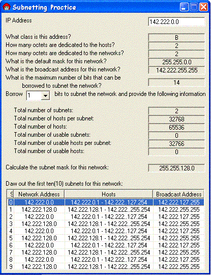

## IP/Subnet Calculator

### Description

calculate information on the class of an ip, and subnetting
 
### More Info
 
Ip address, and how many bits to borrow for the subnet mask

A lot

             |
---                |---
**Submitted On**   |2002-11-16 21:46:48
**By**             |[Techni Rei Myoko](https://github.com/Planet-Source-Code/PSCIndex/blob/master/ByAuthor/techni-rei-myoko.md)
**Level**          |Intermediate
**User Rating**    |4.5 (36 globes from 8 users)
**Compatibility**  |VB 6\.0
**Category**       |[Complete Applications](https://github.com/Planet-Source-Code/PSCIndex/blob/master/ByCategory/complete-applications__1-27.md)
**World**          |[Visual Basic](https://github.com/Planet-Source-Code/PSCIndex/blob/master/ByWorld/visual-basic.md)
**Archive File**   |[IP\_Subnet\_14985911162002\.zip](https://github.com/Planet-Source-Code/techni-rei-myoko-ip-subnet-calculator__1-39647/archive/master.zip)

### API Declarations

None, uses my custom word handling functions

